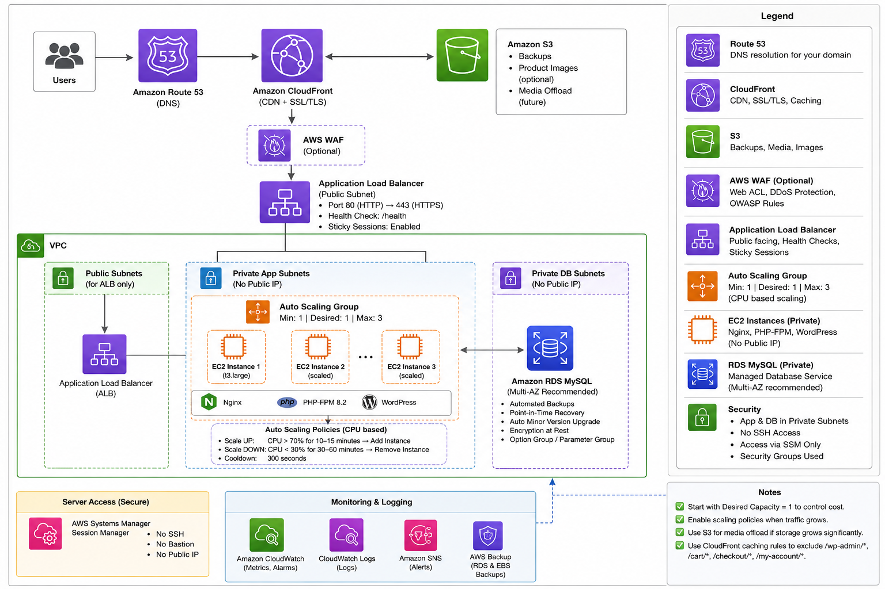

# WordPress on AWS - Production Deployment

## OpenTofu + GitHub Actions + Auto Scaling + SSM (No SSH)

---

## 🏗️ Architecture



> **Production upgrade**: Uncomment `rds.tf` to use managed RDS MySQL instead of local MySQL. Gives you automated backups, Multi-AZ failover, and shared DB across scaled instances.

---

## 💰 Cost Breakdown

### POC Mode (current - MySQL on EC2)

| Service | Monthly Cost |
|---------|-------------|
| EC2 t3.large (2 vCPU, 8GB) | $60 |
| ALB | $22 |
| CloudFront + S3 | $12 |
| NAT Gateway | $5 |
| EBS GP3 100GB | $8 |
| **Total** | **~$107/month** |

### Production Mode (with RDS)

| Service | Monthly Cost |
|---------|-------------|
| EC2 t3.large | $60 |
| RDS db.t3.medium | $50 |
| ALB | $22 |
| CloudFront + S3 | $12 |
| NAT Gateway | $5 |
| EBS GP3 100GB | $8 |
| **Total** | **~$160/month** |

### Auto Scaling Cost (pay only for hours used!)

EC2 is billed **per hour**. If traffic spikes and a 2nd instance runs for 3 hours then shuts down — you pay only for those 3 hours, not the full month.

| Scenario | Extra Cost |
|----------|-----------|
| 2nd EC2 runs 1 hour | +$0.08 |
| 2nd EC2 runs 1 day | +$2.00 |
| 2nd EC2 runs full week | +$14.00 |
| 2nd EC2 runs full month | +$60.00 |

---

## 🔐 GitHub Secrets (Only 5!)

Repository → Settings → Secrets and variables → Actions:

| Secret | Example |
|--------|---------|
| `AWS_ACCESS_KEY_ID` | `AKIA...` |
| `AWS_SECRET_ACCESS_KEY` | `wJalr...` |
| `DB_PASSWORD` | `MyStr0ng!Pass#2024` |
| `WP_ADMIN_PASSWORD` | `Admin!Secure#99` |
| `WP_ADMIN_EMAIL` | `you@domain.com` |

---

## 🚀 Deploy

1. Add the 5 secrets above
2. Go to **Actions** → **Infrastructure - OpenTofu** → **Run workflow**
3. Wait ~10-12 minutes
4. Check output for your WordPress URL

---

## 🌐 Access WordPress

After deployment:

| What | How |
|------|-----|
| **Site URL** | `http://<ALB_DNS>` (from workflow output) |
| **Admin Panel** | `http://<ALB_DNS>/wp-admin/` |
| **WP Username** | `admin` |
| **WP Password** | Your `WP_ADMIN_PASSWORD` secret |

Pre-installed: WordPress + WooCommerce + Redis Cache + S3 Media Offload + SEO permalinks.

---

## 🗄️ MySQL Access

MySQL runs locally on EC2. Connect via SSM first, then:

| Detail | Value |
|--------|-------|
| **Host** | `localhost` |
| **Database** | `wordpress` |
| **Username** | `wpadmin` |
| **Password** | Your `DB_PASSWORD` secret |
| **Port** | `3306` |

### MySQL Commands (after SSM connect)
```bash
# Login to MySQL
mysql -u wpadmin -p wordpress
# Enter your DB_PASSWORD when prompted

# Check database size
mysql -u wpadmin -p -e "SELECT table_schema AS 'Database', 
  ROUND(SUM(data_length + index_length) / 1024 / 1024, 2) AS 'Size (MB)' 
  FROM information_schema.tables GROUP BY table_schema;"

# Check WordPress tables
mysql -u wpadmin -p -e "USE wordpress; SHOW TABLES;"

# Manual backup
cd /var/www/wordpress && sudo -u www-data wp db export /tmp/backup.sql
```

---

## 🖥️ Server Access (SSM)

No SSH. No bastion. No key pairs.

```bash
# Find instance
aws ec2 describe-instances \
  --filters "Name=tag:Name,Values=wp-prod-wordpress-asg" "Name=instance-state-name,Values=running" \
  --query 'Reservations[].Instances[].InstanceId' --output text --region us-east-1

# Connect
aws ssm start-session --target i-0abc123def456 --region us-east-1
```

Or: **AWS Console → EC2 → Select Instance → Connect → Session Manager**

---

## 📈 Auto Scaling

| Condition | Action | Cooldown |
|-----------|--------|----------|
| Memory ≥ 70% for 15 min | +1 instance | 10 min |
| CPU ≥ 70% for 15 min | +1 instance | 10 min |
| Memory < 70% for 6 hours | -1 instance | 6 hours |
| CPU < 70% for 6 hours | -1 instance | 6 hours |

- Min: 1 │ Max: 3
- New instances auto-join ALB after ~10 min (userdata completes)
- You only pay for scaled instances **during the hours they run**

---

## 🔄 CI/CD

| Trigger | What Happens |
|---------|-------------|
| Push to `infra/` | `tofu plan` → `tofu apply` |
| Push to `scripts/` | Clears cache on all instances |
| Manual: `clear-cache` | Flush Nginx + Redis + OPcache |
| Manual: `backup` | DB dump → S3 |
| Manual: `restart-services` | Restart Nginx + PHP + Redis |
| Manual: `update-wordpress` | WP core + plugin updates |
| Daily 6 AM | Health check (status + response time) |
| Weekly Sunday | Security patches + WP updates |

Run manual actions: **Actions tab → "Deploy & Manage WordPress" → Run workflow**

---

## 🐛 Debugging

### Connect to server
```bash
aws ssm start-session --target <instance-id> --region us-east-1
```

### Check setup log
```bash
cat /var/log/userdata.log
# Look for "✅ WordPress Ready!" at the end
```

### WordPress issues
```bash
cd /var/www/wordpress
sudo -u www-data wp db check          # DB connection
sudo -u www-data wp plugin list       # Plugins
redis-cli ping                        # Redis (expect PONG)
sudo nginx -t                         # Nginx config
sudo systemctl status php8.2-fpm     # PHP status
sudo systemctl status mysql           # MySQL status
```

### View logs
```bash
tail -f /var/log/nginx/error.log
tail -f /var/log/php/wordpress-error.log
tail -f /var/log/mysql/error.log
```

### Clear everything
```bash
sudo rm -rf /var/cache/nginx/fastcgi/*
redis-cli FLUSHALL
sudo systemctl restart php8.2-fpm nginx
```

---

## 🔒 Security

| Feature | Status |
|---------|--------|
| EC2 in private subnet (no public IP) | ✅ |
| No SSH, no bastion | ✅ |
| ALB shields EC2 | ✅ |
| IMDSv2 enforced | ✅ |
| S3 private (OAC only) | ✅ |
| All storage encrypted | ✅ |
| Fail2Ban + UFW | ✅ |
| xmlrpc.php blocked | ✅ |
| Security headers | ✅ |
| WP file editing disabled | ✅ |

---

## 🌍 Custom Domain + SSL

1. Uncomment ACM + HTTPS listener in `infra/alb.tf`
2. Set `domain_name = "yourdomain.com"` in terraform.tfvars
3. Push to main → deploys automatically
4. Add DNS CNAME: `yourdomain.com → ALB DNS`
5. SSL is automatic (ACM + ALB, free forever)

---

## 🔄 Switch to RDS (Production)

When moving to your real AWS account:

1. Uncomment everything in `infra/rds.tf`
2. In `infra/autoscaling.tf`, change `db_host` from `"localhost"` to `aws_db_instance.wordpress.address`
3. Remove MySQL install section from `infra/userdata.sh`
4. Uncomment RDS alarms in `infra/monitoring.tf`
5. Run `tofu apply`

---

## 📁 Files

```
├── .github/workflows/
│   ├── infra.yml          # OpenTofu plan + apply
│   ├── deploy.yml         # Cache, backup, restart, update
│   └── maintenance.yml    # Health checks + weekly patches
├── infra/
│   ├── main.tf            # VPC, Subnets, NAT, Routes
│   ├── ec2.tf             # Security Group, IAM, AMI
│   ├── alb.tf             # ALB, Target Group, Listeners
│   ├── autoscaling.tf     # Launch Template, ASG, Scaling
│   ├── rds.tf             # MySQL 8.0 (commented - POC mode)
│   ├── s3-cloudfront.tf   # S3 + CloudFront CDN
│   ├── monitoring.tf      # CloudWatch Alarms, SNS
│   ├── state.tf           # Remote state (S3 + DynamoDB)
│   ├── userdata.sh        # Server bootstrap (installs everything)
│   └── variables.tf       # Inputs
├── scripts/
│   ├── migrate.sh         # SiteGround → AWS
│   └── ssl-setup.sh       # Domain SSL
└── README.md
```
